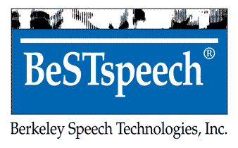

  

# BeSTspeak

This is a very straightforward text to speech speak window that interfaces with Berkeley Speech Technologies' vintage BeSTspeech T-T-S speech synthesizer via API calls.

BeSTspeech has been used in both vintage hardware (such as the BrailleNote under the Keynote GOLD name, telephony devices such as fax machines, and talking translators and dictionaries such as the Franklin Language Master LM-4000) and software (Nisus Writer, Amazing Writing Machine, and Speech Systems Phonetic Engine PE500).

<audio controls>
    <source src="bestspeak_demo.mp3" type="audio/mpeg">
</audio>
